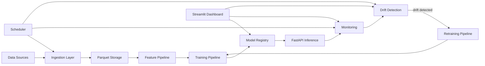

# Scalable Machine Learning Pipeline

A **production-style ML pipeline** built from scratch, demonstrating the full ML lifecycle: data ingestion → feature engineering → model training → model registry → inference API → monitoring → drift detection → automated retraining.

> **Domain**: Weather forecasting — predicting temperature using the free [Open-Meteo API](https://open-meteo.com/).

---

## Architecture

```
Data Source → Ingestion → Storage → Feature Engineering
→ Training Pipeline → Model Registry → Inference API
→ Monitoring → Drift Detection → Retraining Trigger
```



## Project Structure

```
ml-pipeline/
├── api/                    # FastAPI inference service
│   ├── app.py              # API endpoints (/predict, /health, /model/info)
│   └── schemas.py          # Pydantic request/response models
├── configs/
│   └── default.yaml        # Central configuration
├── dashboard/
│   └── app.py              # Streamlit monitoring dashboard
├── data/                   # Data storage (gitignored)
│   └── raw/                # Versioned Parquet files
├── drift/
│   └── detector.py         # KS-test data & concept drift detection
├── features/
│   └── pipeline.py         # FeaturePipeline (fit/transform pattern)
├── ingestion/
│   ├── ingest.py           # CLI data ingestion
│   ├── sources.py          # Data source classes (API, CSV, JSON)
│   └── validation.py       # Schema validation
├── models/                 # Model artifacts (gitignored)
│   └── registry.py         # Versioned model registry
├── monitoring/
│   └── monitor.py          # Prediction logging & reporting
├── scheduler/
│   └── runner.py           # Automated task scheduling
├── training/
│   ├── train.py            # Training pipeline (GridSearchCV)
│   └── retrain.py          # Automated retraining pipeline
├── tests/                  # Test suite
├── utils/
│   ├── config.py           # YAML config loader
│   └── logger.py           # Shared logging
├── requirements.txt
└── README.md
```

## Quick Start

### 1. Install Dependencies

```bash
pip install -r requirements.txt
```

### 2. Ingest Data

```bash
# Fetch 30 days of weather data from Open-Meteo
python -m ingestion.ingest --source weather_api --start-date 2024-01-01 --end-date 2024-01-31

# Or from a local CSV
python -m ingestion.ingest --source csv --file-path data/raw/my_data.csv
```

### 3. Train a Model

```bash
python -m training.train
```

This will:
- Load the latest ingested data
- Run the feature engineering pipeline
- Perform hyperparameter tuning with cross-validation
- Save the best model to the registry

### 4. Start the Inference API

```bash
uvicorn api.app:app --reload
```

Then make predictions:

```bash
curl -X POST http://localhost:8000/predict \
  -H "Content-Type: application/json" \
  -d '{
    "temperature_2m": 15.2,
    "relative_humidity_2m": 65.0,
    "dew_point_2m": 8.5,
    "apparent_temperature": 13.1,
    "pressure_msl": 1013.25,
    "surface_pressure": 1010.0,
    "precipitation": 0.0,
    "rain": 0.0,
    "snowfall": 0.0,
    "cloud_cover": 40.0,
    "wind_speed_10m": 12.5,
    "wind_direction_10m": 180.0,
    "wind_gusts_10m": 25.0,
    "hour": 14
  }'
```

### 5. Launch the Dashboard

```bash
streamlit run dashboard/app.py
```

### 6. Run the Scheduler

```bash
python -m scheduler.runner
```

### 7. Force Retrain

```bash
python -m training.retrain --force
```

## Key Components

### Feature Pipeline

Uses a **fit/transform pattern** to ensure train-inference parity:

```python
from features.pipeline import FeaturePipeline

pipeline = FeaturePipeline()
pipeline.fit(training_data)          # Learn medians, scaler params
features = pipeline.transform(data)  # Apply same transform at inference
pipeline.save()                      # Persist for API use
```

Features include: lag features, rolling averages, cyclical encoding (hour → sin/cos), and standard scaling.

### Model Registry

Versioned model storage with metadata:

```
models/
├── model_v1.pkl
├── model_v2.pkl
└── metadata.json    # tracks: accuracy, date, dataset version, hyperparams
```

### Drift Detection

Uses the **Kolmogorov-Smirnov test** to detect distribution shifts:

```python
from drift.detector import DataDriftDetector

detector = DataDriftDetector()
detector.save_baseline(training_distributions)
report = detector.detect(current_data)

if report["drift_detected"]:
    trigger_retraining()
```

### Monitoring

Logs every prediction for analysis:

```json
{
  "prediction": 16.82,
  "input_features": {"temperature_2m": 15.2, ...},
  "confidence": {"std": 0.45},
  "model_version": 3,
  "timestamp": "2024-01-15T14:30:00"
}
```

## Running Tests

```bash
# All tests
python -m pytest tests/ -v

# Specific modules
python -m pytest tests/test_features.py -v
python -m pytest tests/test_drift.py -v
python -m pytest tests/test_integration.py -v
```

## Tech Stack

| Component | Technology |
|-----------|-----------|
| ML | Scikit-learn, NumPy, Pandas |
| API | FastAPI, Uvicorn, Pydantic |
| Dashboard | Streamlit |
| Storage | Parquet (PyArrow) |
| Drift Detection | SciPy (KS test) |
| Scheduling | schedule |
| Testing | pytest |

## License

MIT
