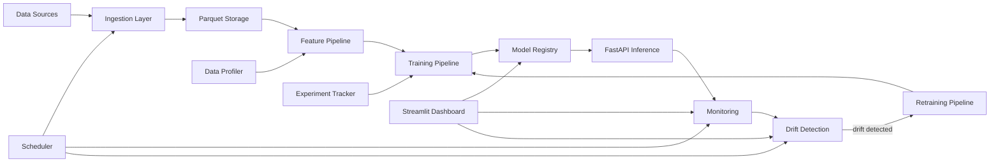

# Scalable Machine Learning Pipeline

[](https://www.python.org/downloads/)
[](https://opensource.org/licenses/MIT)
[](https://github.com/YOUR_USERNAME/Scalable-Machine-Learning-Pipeline/actions)

A **production-style ML pipeline** built from scratch, demonstrating the full ML lifecycle: data ingestion → feature engineering → model training → model registry → inference API → monitoring → drift detection → automated retraining.

> **Domain**: Weather forecasting — predicting temperature using the free [Open-Meteo API](https://open-meteo.com/).

---

## Architecture



## Project Structure

```
ml-pipeline/
├── api/                        # FastAPI inference service
│   ├── app.py                  # API endpoints (/predict, /health, /ready, /metrics, /model/reload)
│   └── schemas.py              # Pydantic request/response models
├── configs/
│   └── default.yaml            # Central configuration
├── dashboard/
│   └── app.py                  # Streamlit monitoring dashboard (7 pages)
├── data/                       # Data storage (gitignored)
│   ├── raw/                    # Versioned Parquet files
│   └── profiles/               # Data profiling reports
├── drift/
│   └── detector.py             # KS-test data & concept drift detection
├── experiments/                # Experiment tracking (gitignored)
│   ├── runs.jsonl              # All training run logs
│   └── importance/             # Feature importance reports
├── features/
│   ├── pipeline.py             # FeaturePipeline (fit/transform pattern)
│   ├── profiler.py             # Data quality profiling
│   └── importance.py           # Feature importance analysis
├── ingestion/
│   ├── ingest.py               # CLI data ingestion
│   ├── sources.py              # Data source classes (API, CSV, JSON)
│   └── validation.py           # Schema validation
├── models/                     # Model artifacts (gitignored)
│   └── registry.py             # Versioned model registry
├── monitoring/
│   └── monitor.py              # Prediction logging & reporting
├── scheduler/
│   └── runner.py               # Automated task scheduling
├── training/
│   ├── train.py                # Training pipeline (GridSearchCV + experiment tracking)
│   ├── retrain.py              # Automated retraining pipeline
│   └── tracker.py              # Experiment tracker
├── tests/                      # Test suite
├── utils/
│   ├── config.py               # YAML config loader
│   ├── logger.py               # Shared logging
│   └── validators.py           # Pydantic config validation
├── .github/workflows/ci.yml   # GitHub Actions CI pipeline
├── Dockerfile                  # Container for API service
├── docker-compose.yml          # Multi-service orchestration
├── Makefile                    # One-command workflows
├── pyproject.toml              # Python packaging & tool config
├── requirements.txt
└── README.md
```

## Quick Start

### 1. Install Dependencies

```bash
pip install -r requirements.txt
# Or use the Makefile:
make install
```

### 2. Quick Demo (4 lines)

```bash
make install                    # Install dependencies
make ingest                     # Fetch 30 days of weather data
make train                      # Train a model with hyperparameter tuning
make api                        # Start the inference API on localhost:8000
```

### 3. Ingest Data

```bash
# Fetch 30 days of weather data from Open-Meteo
python -m ingestion.ingest --source weather_api --start-date 2024-01-01 --end-date 2024-01-31

# Or from a local CSV
python -m ingestion.ingest --source csv --file-path data/raw/my_data.csv
```

### 4. Train a Model

```bash
python -m training.train
```

This will:
- Load the latest ingested data
- Generate a data quality profile
- Run the feature engineering pipeline
- Perform hyperparameter tuning with cross-validation
- Analyze feature importance
- Log everything to the experiment tracker
- Save the best model to the registry

### 5. Start the Inference API

```bash
uvicorn api.app:app --reload
```

Then make predictions:

```bash
curl -X POST http://localhost:8000/predict \
  -H "Content-Type: application/json" \
  -d '{
    "temperature_2m": 15.2,
    "relative_humidity_2m": 65.0,
    "dew_point_2m": 8.5,
    "apparent_temperature": 13.1,
    "pressure_msl": 1013.25,
    "surface_pressure": 1010.0,
    "precipitation": 0.0,
    "rain": 0.0,
    "snowfall": 0.0,
    "cloud_cover": 40.0,
    "wind_speed_10m": 12.5,
    "wind_direction_10m": 180.0,
    "wind_gusts_10m": 25.0,
    "hour": 14
  }'
```

**API Endpoints:**

| Endpoint | Method | Description |
|----------|--------|-------------|
| `/predict` | POST | Get a temperature prediction |
| `/health` | GET | Health check with model info |
| `/ready` | GET | Kubernetes-style readiness probe |
| `/metrics` | GET | API performance (latency, error rate) |
| `/model/info` | GET | Production model metadata |
| `/model/reload` | POST | Hot-reload model without restart |
| `/models` | GET | List all registered models |

### 6. Launch the Dashboard

```bash
streamlit run dashboard/app.py
```

**Dashboard Pages:**
- 📊 Model Performance — metrics over time
- 🧪 Experiments — full run history with hyperparameters
- 🔑 Feature Importance — which features matter most
- 🔍 Drift Metrics — data drift detection results
- 📈 Feature Distributions — input feature stats
- 🎯 Predictions — recent prediction timeline
- 📦 Model Registry — versioned model catalog

### 7. Docker Deployment

```bash
# Start API + Dashboard
docker-compose up -d

# API: http://localhost:8000
# Dashboard: http://localhost:8501
```

### 8. Run the Scheduler

```bash
python -m scheduler.runner
```

### 9. Force Retrain

```bash
python -m training.retrain --force
```

## Key Components

### Experiment Tracker

Every training run is automatically logged with full reproducibility info:

```python
from training.tracker import ExperimentTracker

tracker = ExperimentTracker(experiment_name="my_experiment")
tracker.start_run()
tracker.log_params({"n_estimators": 100, "max_depth": 20})
tracker.log_metrics({"mae": 1.23, "r2": 0.95})
tracker.log_data_info(training_df)
tracker.end_run()

# Compare runs
best = ExperimentTracker.get_best_run(metric="mae")
```

### Feature Pipeline

Uses a **fit/transform pattern** to ensure train-inference parity:

```python
from features.pipeline import FeaturePipeline

pipeline = FeaturePipeline()
pipeline.fit(training_data)          # Learn medians, scaler params
features = pipeline.transform(data)  # Apply same transform at inference
pipeline.save()                      # Persist for API use
```

Features include: lag features, rolling averages, cyclical encoding (hour → sin/cos), and standard scaling.

### Data Profiler

Automatic data quality analysis before training:

```python
from features.profiler import DataProfiler

profiler = DataProfiler()
report = profiler.profile(df, name="training_data")
# → Missing values, outliers (IQR), correlations, skewness, temporal gaps
```

### Feature Importance

Multi-method importance analysis after training:

```python
from features.importance import FeatureImportanceAnalyzer

analyzer = FeatureImportanceAnalyzer()
report = analyzer.analyze(model, X_test, y_test, model_version=1)
# → Built-in (Gini) + Permutation importance + Combined ranking
```

### Model Registry

Versioned model storage with metadata:

```
models/
├── model_v1.pkl
├── model_v2.pkl
└── metadata.json    # tracks: accuracy, date, dataset version, hyperparams
```

### Drift Detection

Uses the **Kolmogorov-Smirnov test** to detect distribution shifts:

```python
from drift.detector import DataDriftDetector

detector = DataDriftDetector()
detector.save_baseline(training_distributions)
report = detector.detect(current_data)

if report["drift_detected"]:
    trigger_retraining()
```

### Monitoring

Logs every prediction for analysis:

```json
{
  "prediction": 16.82,
  "input_features": {"temperature_2m": 15.2, ...},
  "confidence": {"std": 0.45},
  "model_version": 3,
  "timestamp": "2024-01-15T14:30:00"
}
```

### Config Validation

Configuration is validated at load time using Pydantic:

```python
# Bad config values are caught immediately with clear error messages:
# "training.test_size: Input should be greater than 0"
# "drift.ks_threshold: Input should be less than 1"
```

## Makefile Commands

| Command | Description |
|---------|-------------|
| `make install` | Install dependencies |
| `make ingest` | Fetch 30 days of weather data |
| `make train` | Train a model |
| `make api` | Start FastAPI server |
| `make dashboard` | Launch Streamlit |
| `make test` | Run all tests |
| `make lint` | Lint with ruff |
| `make clean` | Remove generated artifacts |
| `make all` | Full pipeline: ingest → train → test |

## Running Tests

```bash
# All tests
python -m pytest tests/ -v

# Specific modules
python -m pytest tests/test_features.py -v
python -m pytest tests/test_drift.py -v
python -m pytest tests/test_integration.py -v

# Quick (skip integration)
make test-fast
```

## Tech Stack

| Component | Technology |
|-----------|-----------|
| ML | Scikit-learn, NumPy, Pandas |
| API | FastAPI, Uvicorn, Pydantic |
| Dashboard | Streamlit |
| Storage | Parquet (PyArrow) |
| Drift Detection | SciPy (KS test) |
| Experiment Tracking | Custom JSONL tracker |
| Config Validation | Pydantic |
| Containerization | Docker, Docker Compose |
| CI/CD | GitHub Actions |
| Scheduling | schedule |
| Testing | pytest |

## Contributing

1. Fork the repository
2. Create a feature branch: `git checkout -b feature/my-feature`
3. Make your changes and add tests
4. Run `make lint` and `make test`
5. Submit a pull request

## Roadmap

- [ ] Add A/B testing support for model comparison
- [ ] Integrate with cloud model registries (MLflow, Weights & Biases)
- [ ] Add Grafana/Prometheus monitoring
- [ ] Support additional ML algorithms (XGBoost, LightGBM)
- [ ] Add data versioning with DVC
- [ ] Real-time streaming predictions with WebSockets

## License

MIT
